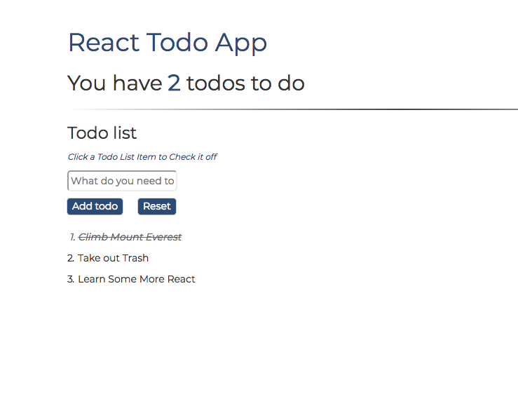

# React Todo App

<h2>What is React Todo App?</h2>
This is a simple Front end Todo List app that I built using React. The main reason for this application was to revise many of the fundamental concepts of React such as setting state, passing props and rendering components.

<h2>How to use</h2>

Simply type in a Todo list item that you want to add in the input field and press enter. Once you have entered all of your list items, you can 'check' them off by clicking on them. At the top, the number of todo list items you have will be displayed. To completed clear the list, simply press the 'clear' button.

<h2>Technologies Used</h2>
<ul>
<li>HTML5</li>
<li>CSS3 / SCSS</li>
<li>JavaScript (ES6)</li>
<li>React.js</li>
<li>Git</li>
<li>Github</li>
</ul>

<h2>Wins</h2>
Building this app allowed me to revisit and familiarise myself with the core concepts of react and I like the simplistic yet stylish design I was able to accomplish.

<h2>Challenges</h2>
For some reason, I was unable to add the reset button inside of the Submit form, as doing so would not reset the todo list entirely but would remove everything, except for leaving the first item as an empty string. I therefore, had to use relative positioning to display the buttons next to each other to make the app aesthetically pleasing.  

<h2>Future Improvements</h2>
To improve this app further, It would cool If I could make it so that you can rearrange the order of the todo list items by clicking an 'up' or 'down' arrow.
